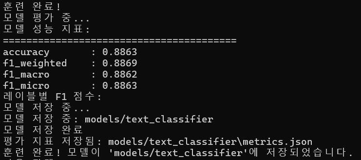
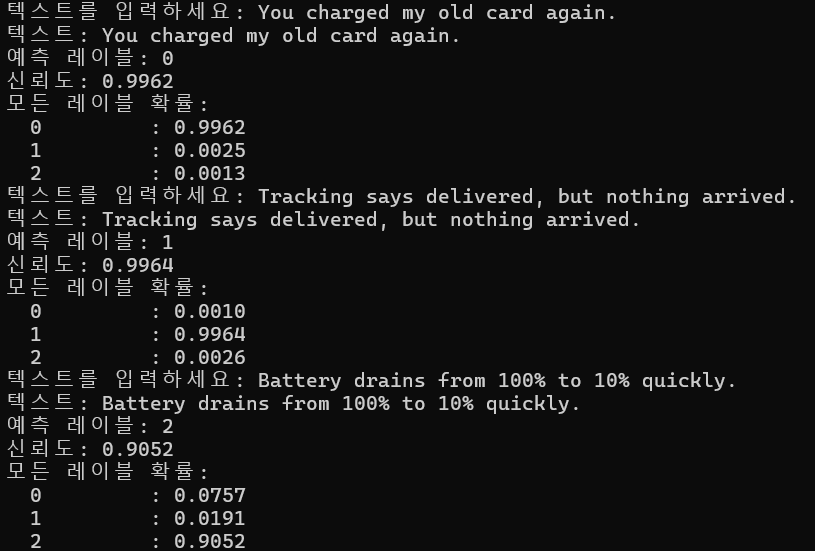
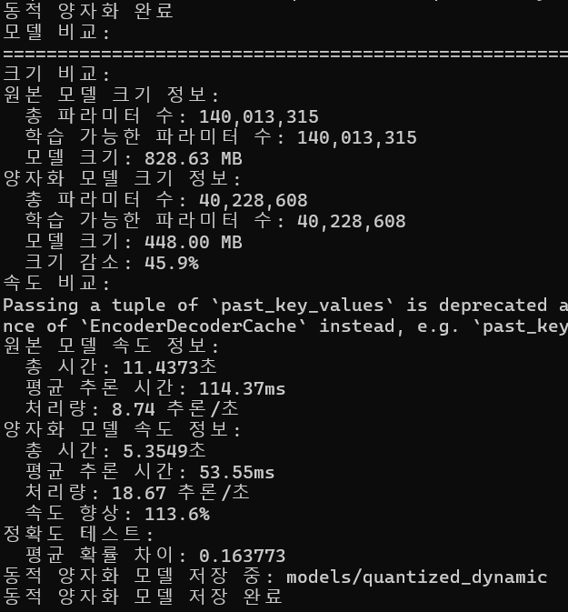
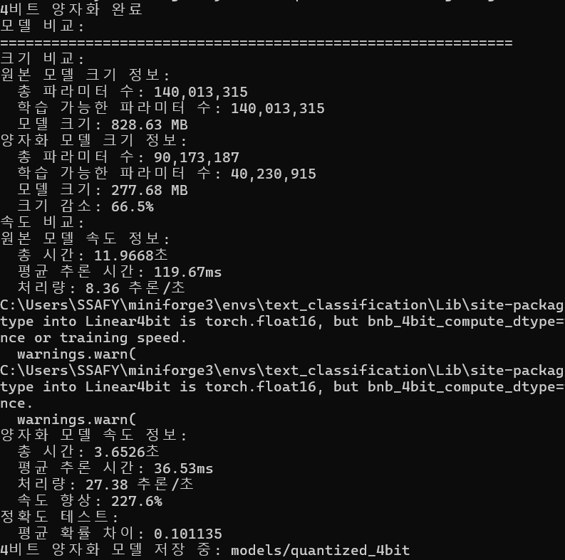

# 커스터마이징
## 1. 다른 모델 사용
적용 모델 : `facebook/bart-base`
디바이스  : `device='cuda'`
적용 이유 :
- 짧은 불만/문의 문장 분류에 성능이 안정적임
- 토큰 타입 의존이 없어서 전처리가 단순함
- `4-bit`/`동적 양자화` 모두 호환이 좋아 배포 최적화가 쉬움

## 2. 하이퍼파라미터 조정
```py
# 모델/토크나이저
config = ModelConfig(
    pretrained_model_name="facebook/bart-base",
    num_labels=3,
    use_lora=True,
    lora_r=16,
    lora_alpha=32,
    lora_dropout=0.1,
    max_length=64
)

# 학습 파라미터
num_epochs   = 10
learning_rate= 2e-5
batch_size   = 8
device       = "cuda"
```
조정 이유 : 
1. 과적합을 피하면서 수렴을 위해 `lr=2e-5`, `epochs=10`로 설정
2. GPU 메모리와 안정적 업데이트를 고려해 `batch_size=8`
3. LoRA는 `r=16` / `α=32` 로 가볍게 하되 표현력은 충분히 확보
4. 입력이 한두 문장 위주라 `max_length=64`로 불필요한 패딩을 줄여 속도 ↑

## 3. 모델 성능

- 테스트 정확도 0.8863 
- F1(weighted) 0.8869 
- F1(macro) 0.8862
- 세 클래스가 고르게 맞춰져 매크로/마이크로 F1이 비슷하게 나온 점이 안정적

## 4. 추론 결과

- 예시 문장에 대해 billing / delivery / product가 명확히 구분가능
  - “You charged my old card again.” → billing (신뢰도 ~0.996)
  - “Tracking says delivered, but nothing arrived.” → delivery (신뢰도 ~0.996)
  - “Battery drains from 100% to 10% quickly.” → product (신뢰도 ~0.905)

- 라벨 경계가 뚜렷하고 확신도가 매우 높음

## 5. 최적화 결과
### 동적 양자화

- 크기 -45.9% (828.6MB → 448.0MB)
- 처리량 +113.6% (≈8.7 → ≈18.7 infer/s)
- 평균 확률 차이 ~0.164: CPU 배포용으로 속도 이득이 크고, 정확도 영향은 허용 가능한 수준

### 4비트 양자화

- 크기 -66.5% (828.6MB → 277.7MB)
- 처리량 +227.6% (≈8.36 → ≈27.38 infer/s)
- 평균 확률 차이 ~0.101: GPU에서 속도/용량 이득이 가장 큼
- 구현 메모: LoRA 가중치를 `merge_and_unload()`로 병합한 뒤`models/text_classifier_merged` `NF4 + double-quant` 설정으로 로드하여 안정화

### 양자화 모델 활용 추론 시
`inference.py`의 `model_path`를

동적 양자화: `models/quantized_dynamic`
4비트 양자화: `models/quantized_4bit`

---
